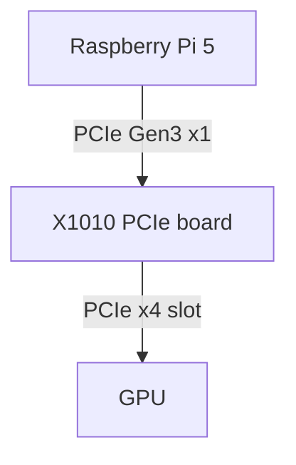

# Architecture

## System Overview

tiny-llm-node uses Raspberry Pi 5 as PCIe host for a GPU.

The GPU performs LLM inference.

---

## Block Diagram

---

## Data Flow

1. prompt is sent to llama.cpp
2. model is loaded to GPU VRAM
3. inference runs on GPU
4. tokens returned to host

---

## PCIe bandwidth considerations

PCIe Gen3 x1 bandwidth is sufficient for inference workloads because:

- model weights reside in VRAM
- minimal host-device transfer required

