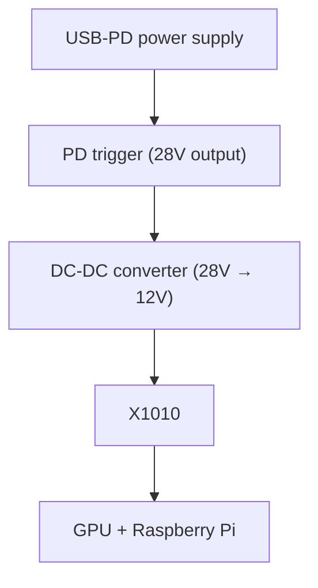

# Power Design

## Overview

tiny-llm-node uses USB-PD as its primary power source.

Goal:

single-cable power input.

---

## Power chain

---

## Selected components

PD trigger:
USB PD 3.2 trigger module

DC-DC converter:
Elecbee 200W buck converter

---

## Power budget estimate

GPU (RTX4060): 100-120W
Raspberry Pi 5: 10-12W
PCIe board: 5-10W

Total:
120-140W

---

## design margin

DC-DC capacity: 200W

Provides margin for transient spikes.